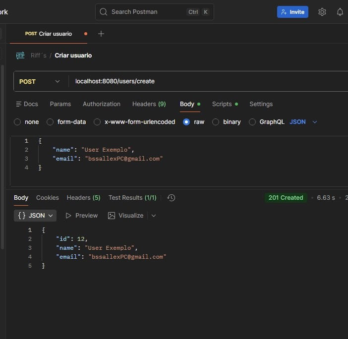
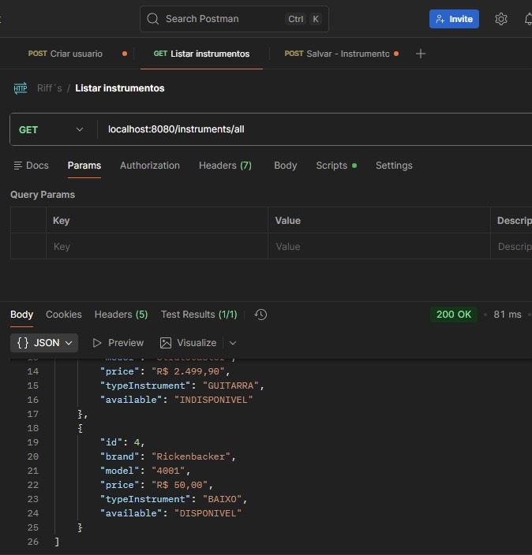
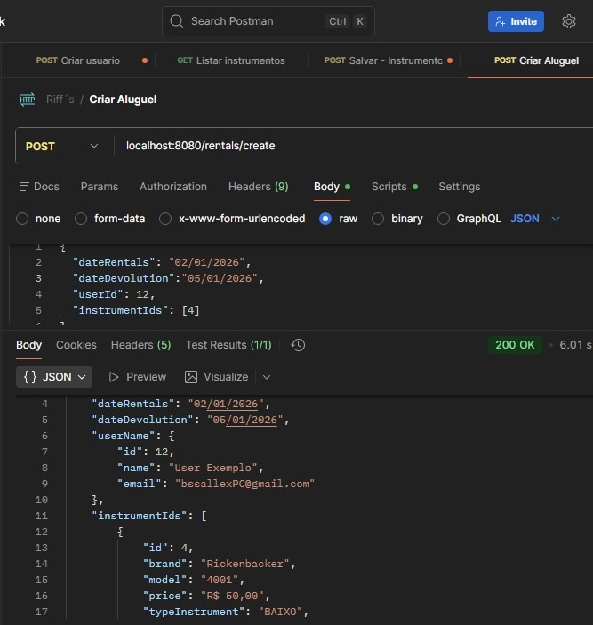
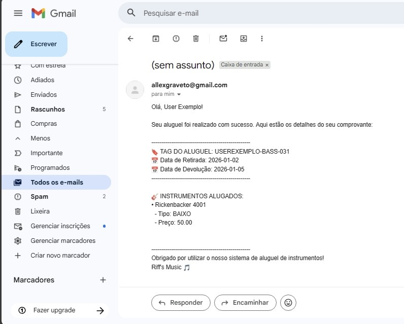

# 🎸 Aluguel de Instrumentos Musicais

API REST desenvolvida para gerenciar o aluguel de instrumentos musicais.
Permite que usuários realizem cadastro, consultem o catálogo de instrumentos disponíveis e efetuem aluguéis.
Ao confirmar o aluguel, o sistema envia um email ao usuário contendo todas as informações, como: data de devolução, instrumento escolhido e demais detalhes da locação.

---

## 📊 Tecnologias e Ferramentas

* **Java 17**
* **Spring Boot**
* **Arquitetura de Microserviços**
* **Lombok**
* **DTOs**
* **Maven**
* **Docker + PostgreSQL**
* **Flyway**
* **RabbitMQ** (mensageria entre serviços)
* **Exceções personalizadas**
* **SMTP** (envio de emails)
* **Validation**
* **Jackson-Datatype**

---

## 🏗️ Arquitetura da Aplicação (Visão Técnica)

Aplicação baseada em **microserviços**, com comunicação síncrona via HTTP e comunicação assíncrona orientada a eventos utilizando **RabbitMQ**.

```
Client
  │
  ▼
[ User Service ] ──┐
                   ├──► [ Rentals Service ] ──► RabbitMQ ──► [ Email Service ]
[ Instrument Service ] ┘
```

**Responsabilidades dos serviços:**

* **User Service**: gerenciamento de usuários
* **Instrument Service**: catálogo de instrumentos disponíveis
* **Rentals Service**: orquestração e persistência dos aluguéis
* **Email Service**: envio de notificações via SMTP
* **RabbitMQ**: mensageria assíncrona entre serviços

---

## 📂 Estrutura Interna dos Microserviços

Usuário, Catálogo e Aluguel

```
Rentals
├── configuration
├── controller
├── docs
├── dto
├── entity
├── enums
├── exceptions
├── repository
└── service

Email
├── configuration
├── dto
├── entity
├── enums
├── exceptions
├── repository
└── service
```

Essa organização facilita a manutenção, escalabilidade e padronização entre os serviços.

---

## 🚀 Funcionalidades

### 👤 Usuários (User Service)

* 🔍 Listar todos os usuários
* 🔍 Buscar usuário por ID
* 📝 Criar novo usuário
* ✏️ Atualizar dados do usuário
* 🗑️ Deletar usuário

---

### 🎸 Instrumentos (Instrument Service)

* 🔍 Listar todos os instrumentos
* 🔍 Buscar instrumento por ID
* 📝 Cadastrar novo instrumento
* ✏️ Atualizar dados do instrumento
* 🗑️ Deletar instrumento

---

### 📦 Aluguéis (Rentals Service)

* 🔍 Listar todos os aluguéis
* 🔍 Buscar aluguel pelo nome do usuário
* 📝 Criar um novo aluguel

  * Ao criar um aluguel, um evento é publicado no **RabbitMQ**

---

### ✉️ Serviço de Email (Email Service)

* 📩 Consome mensagens do RabbitMQ
* 📤 Envia email de confirmação ao usuário contendo:

  * Instrumento alugado
  * Data do aluguel
  * Data de devolução
  * Outras informações relevantes

---

## 🔄 Fluxo de Criação de Aluguel

1. O cliente solicita a criação de um aluguel
2. O **Rentals Service** valida e persiste os dados
3. Um evento de aluguel é publicado no **RabbitMQ**
4. O **Email Service** consome o evento
5. O usuário recebe o email de confirmação 📩

---

## 📸 Exemplo Visual

### Cadastro de usuário

<p align="left">
  
</p>

### Catálogo de instrumento

<p align="left">
  
</p>

### Criando aluguel

<p align="left">
  
</p>

### Email

<p align="left">
  
</p>
   


